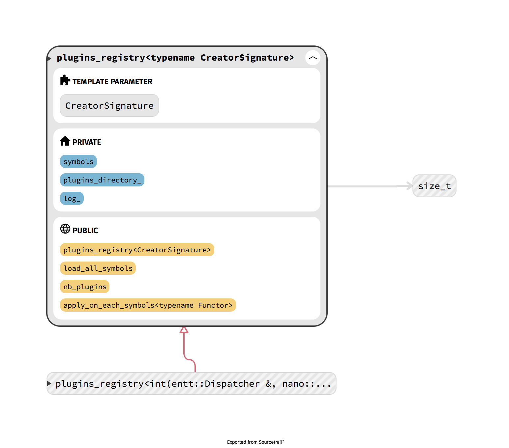

# shiva::dll

## plugins\_registry:

### **Description**

This class will allow you to store plugin creation symbols through its template _**CreatorSignature**_ parameter.  
Through this class you will be able to retrieve the number of plugins, apply a functor on each of the symbols \(as creates the plugin for example\).

### Diagram



### plugins\_registry api



```cpp
template <typename CreatorSignature>
class plugins_registry;
```



```cpp
explicit plugins_registry(shiva::fs::path &&plugins_directory, const std::string library_pattern_matching) noexcept;
```

**plugins\_registry**

**Parameters**

* **plugins\_directory** represents the path to the directory containing the plugins
* **library\_pattern\_matching** represents a basic pattern to respect for libraries to load


For example if the pattern is \[**shiva-system**\] then only libraries that have \[**shiva-system**\] in their names will be loaded. \[**libshiva-system-plugin.so**\] will be loaded \[**libother-things.so**\] will not be loaded.




| Functions Name | Description |
| :--- | :--- |
| [load\_all\_symbols](shiva-dll.md#load_all_symbols) | load all symbols for plugins creation from the plugins\_directory |
| [nb\_plugins](shiva-dll.md#nb_plugins) | return the number of plugins |
| [apply\_on\_each\_symbols](shiva-dll.md#apply_on_each_symbols) | apply a functor on each symbols |



#### load\_all\_symbols

```cpp
bool load_all_symbols() noexcept;
```

**Return value**

* `true` if all the symbols of all the libraries have been correctly loaded
* `false` if a symbol from one of the libraries was not loaded, or if the **plugins\_directory** doesn't exist

**Notes**

This function allows you to load symbols from the template to create the object.  
The symbols are **loaded recursively** from the folder you specified in the object's constructor.


If one of the symbols could not be correctly loaded the **function does not stop** and proceeds to load the next plugin.  
If when browsing folders a corrupted file is spotted the function will switch to **loading the next plugin**.


#### **nb\_plugins**

```cpp
size_t nb_plugins() const noexcept;
```

**Return value**

* numbers of plugins

#### **apply\_on\_each\_symbols**

```cpp
template <typename Functor>
void apply_on_each_symbols(Functor &&functor);
```

**Template parameters**

* **Functor** Represents the functor to apply on each of the loaded symbols.

**Notes**

* This function applies the **functor** as a parameter to each of the symbols that were previously loaded by the [load\_all\_symbols ](https://shiva.gitbook.io/project/shiva/modules/shiva-dll#load_all_symbols)function.

**Example**

```cpp
auto functor = [this](auto &&symbol) {
                auto res = symbol(//things);
                // manipulate res
            };

plugins_registry_.apply_on_each_symbols(functor);
```

## helpers

| Functions Name | Description |
| :--- | :--- |
| [is\_shared\_library](shiva-dll.md#is_shared_library) | check if a specific path is a shared library |

####  is\_shared\_library

```cpp
static inline bool is_shared_library(const fs::path &path) noexcept;
```

#### Parameters

* **path** the path to be tested

#### Return value

* `true` if the path is a shared\_library, `false` otherwise.

#### Notes

* check if the **path** passed in parameter is a shared library

