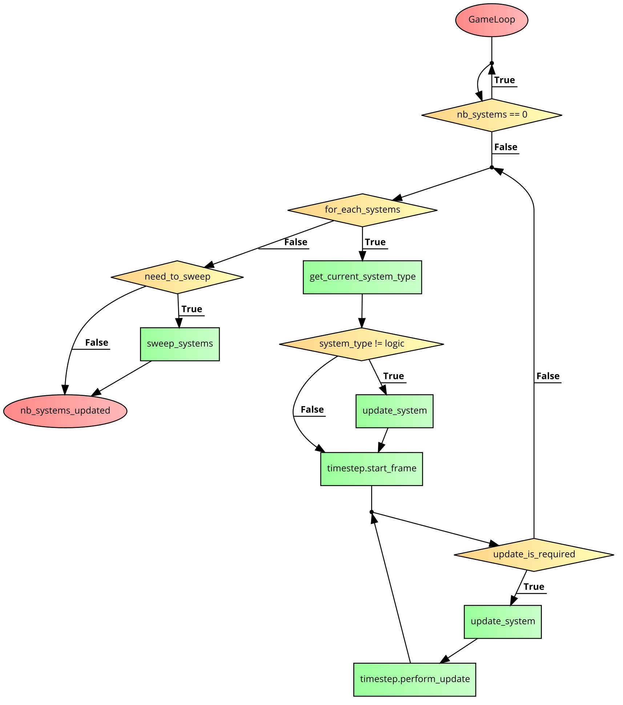

# shiva::ecs


## How works the System

### Game Loop

SFME have 3 differents kinds of systems:

*  **PreUpdate**: These systems are the first to be updated in the game loop, they are generally used to retrieve user input, or manage network events for example.
*  **LogicUpdate**: These systems are the second to be updated in the game loop, they are generally used for game logic such as movement or collisions for example.
*  **PostUpdate**: These systems are the last to be updated in the game loop, they are generally used for rendering or interpolation for example.

The pseudo code will look like this:

```cpp
auto update_system_functor = [&nb_systems_updated](auto &&sys) {
                if (sys->is_enabled()) {
                    sys->update();
                    nb_systems_updated++;
                }
            };

shiva::ranges::for_each(systems_, [this, update_system_functor](auto &&vec) {
     if (!vec.empty()) {
        system_type current_system_type = vec.front()->get_system_type_RTTI();
        shiva::ranges::for_each(this->systems_[current_system_type],
        [this, current_system_type, update_system_functor](auto &&sys) {
               if (current_system_type != system_type::logic_update) {
                  update_system_functor(std::forward<decltype(sys)>(sys));
                  } else {
                  timestep_.start_frame();
                  while (timestep_.is_update_required()) {
                        update_system_functor(std::forward<decltype(sys)>(sys));
                        timestep_.perform_update();
                        }
                  }
              });
        };
});
```


This game loop is based on the gafferon on games tutorial: [Fix your timestep](https://gafferongames.com/game-physics/fix-your-timestep).


### Diagram



