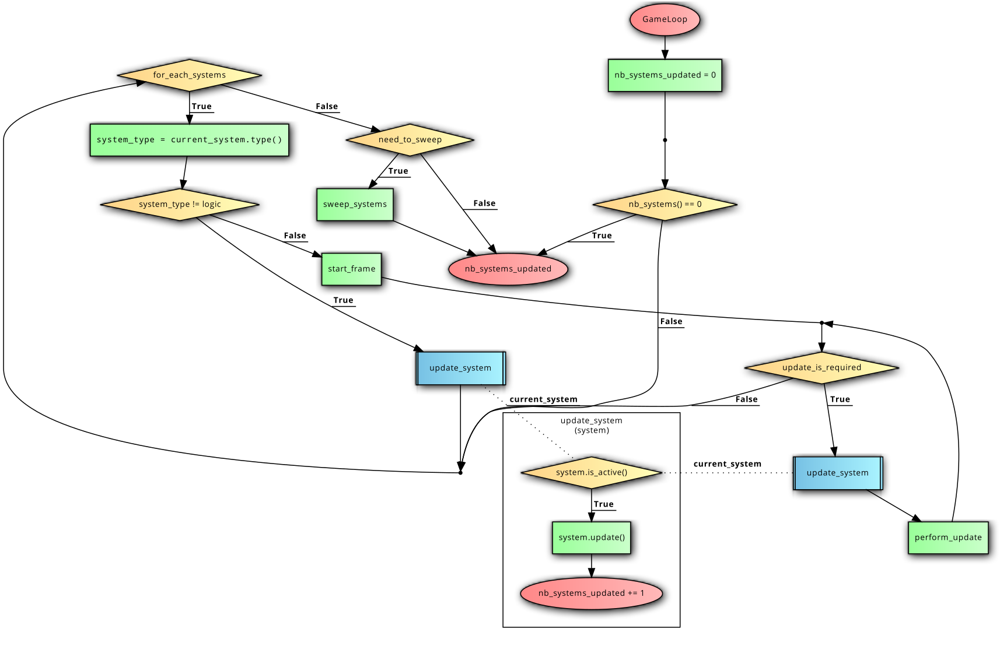
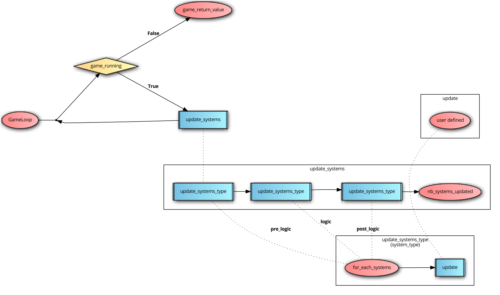
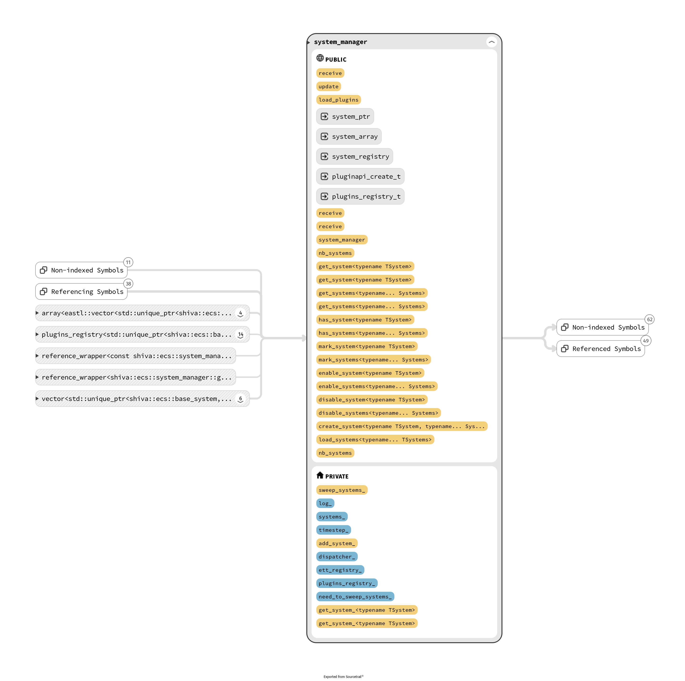
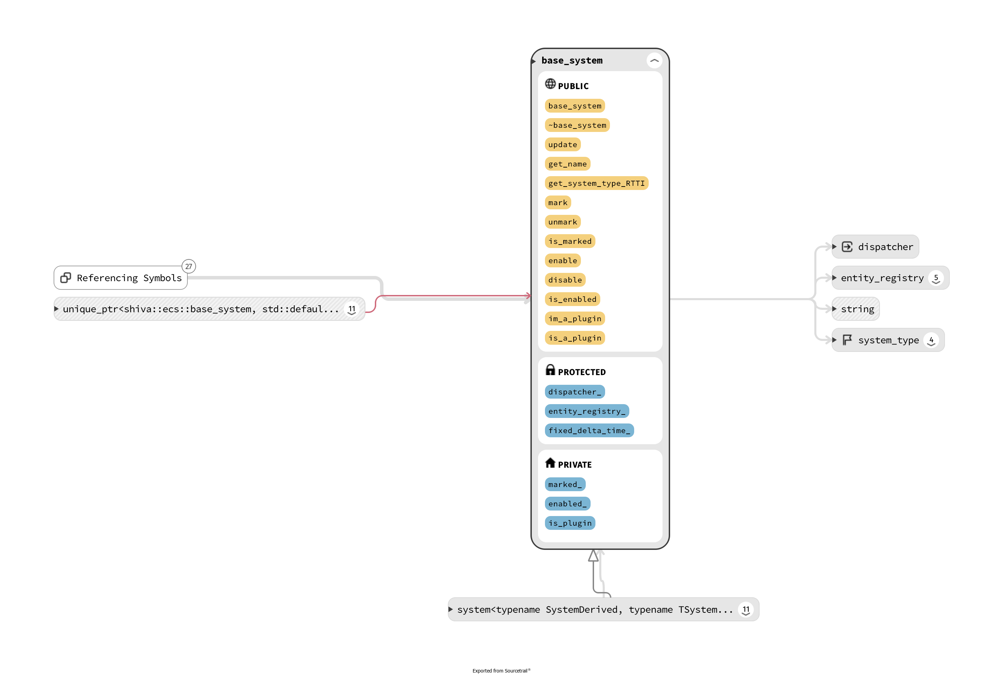
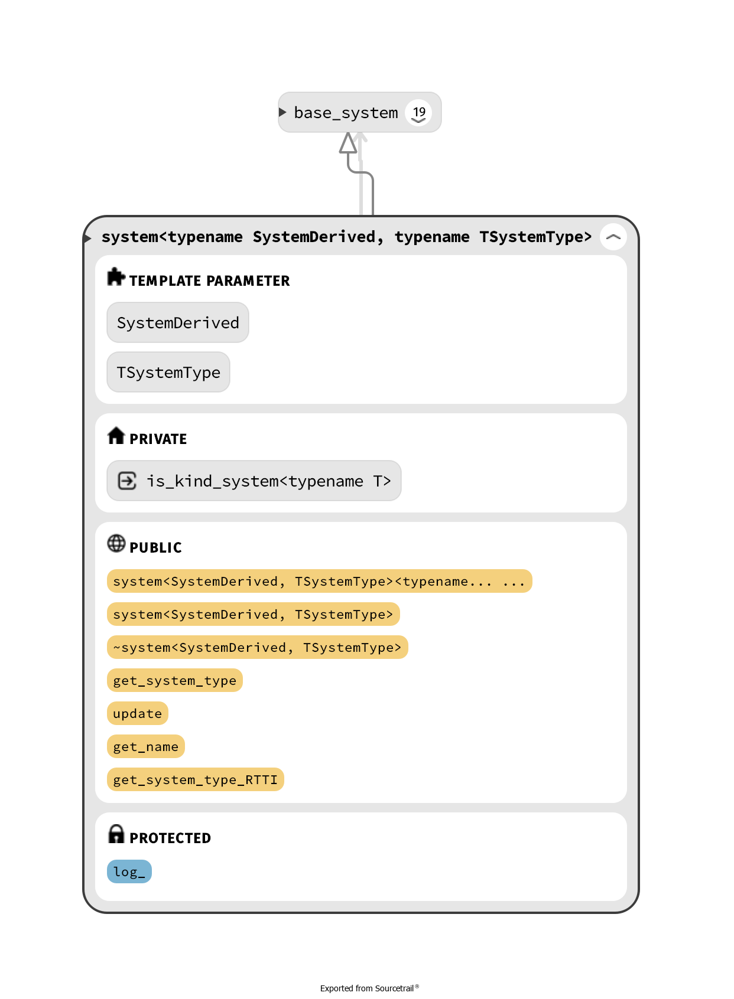

# shiva::ecs

## How do the system works ?

### Systems

Shiva have 3 different kinds of systems:

* **PreUpdate**: These systems are the first to be updated in the game loop, they are generally used to retrieve user input, or manage network events for example.
* **LogicUpdate**: These systems are the second to be updated in the game loop, they are generally used for game logic such as movement or collisions for example.
* **PostUpdate**: These systems are the last to be updated in the game loop, they are generally used for rendering or interpolation for example.

The pseudo code will look like this:

```typescript
function update()
{
  user defined;
}

function update_systems_type(system_type)
{
  for_each_systems;
  call update();
}

function update_systems() 
{
  call update_systems_type(pre_logic);
  call update_systems_type(logic);
  call update_systems_type(post_logic);
  return nb_systems_updated
}

GameLoop;
while (game_running) {
  call update_systems
}
return game_return_value;
```


This game loop is based on the gafferon on games tutorial: [Fix your timestep](https://gafferongames.com/game-physics/fix-your-timestep).


### Diagram





## system\_type

### Description

This file contains an enum representing the different types of [systems presented previously](shiva-ecs.md#how-works-the-system), and three strong types, later used in template parameter by the [system class](shiva-ecs.md#system)

### Diagram

### system\_type api



```cpp
enum system_type
{
  pre_update = 0,
  logic_update = 1,
  post_update = 2,
  size = 3,
};
```



```cpp
using system_pre_update = NamedType<system_type,struct system_pre_update_tag>;
using system_post_update = NamedType<system_type, struct system_post_update_tag>;
using system_logic_update = NamedType<system_type, struct system_logic_update_tag>;
```



## system\_manager

### Description

This class will manage the **systems** of the entity component system. You will be able to `add`, `remove`, `retrieve` , `update` or `delete` systems through it.

### Diagram



### system\_manager api



```cpp
class system_manager;
```



```cpp
explicit system_manager(entt::dispatcher &dispatcher,
                        entt::entity_registry &registry,
                        plugins_registry_t &plugins_registry) noexcept;
```

**Parameters**

* **entt::dispatcher** The `dispatcher` will be provided to the system when it is created.
* **entt::entity\_registry** The `entity_registry` will be provided to the system when it is created.
* ​[plugins\_registry](https://shiva.gitbook.io/project/~/edit/drafts/-LGoUJOpBxBYAeCO4Ght/shiva/modules/shiva-dll#plugins_registry-api) registry of the plugged systems



| Function Name | Description |
| --- | :---: |
| [update](shiva-ecs.md#update) | update the systems |
| [get\_system](shiva-ecs.md#get_system) | get a single system |
| [get\_systems](shiva-ecs.md#get_systems) | get multiple systems |
| [has\_system](shiva-ecs.md#has_system) | check if a system is present |
| [has\_systems](shiva-ecs.md#has_systems) | check if multiple systems are present |
| [mark\_system](shiva-ecs.md#mark_system) | mark a single system |
| [mark\_systems](shiva-ecs.md#mark_systems) | mark multiple systems |
| [enable\_system](shiva-ecs.md#enable_system) | enable a single system |
| [enable\_systems](shiva-ecs.md#enable_systems) | enable multiple systems |
| [disable\_system](shiva-ecs.md#disable_system) | disable a single system |
| [disable\_systems](shiva-ecs.md#disable_systems) | disable multiple systems |
| [create\_system](shiva-ecs.md#create_system) | create a single system |
| [load\_systems](shiva-ecs.md#load_systems) | create multiple systems |



#### update

```cpp
size_t update() noexcept
```

**Return value**

* number of systems successfully updated

**Notes**

This is the function that will update your **systems**. Based on the logic of the different kinds of [shiva systems](shiva-ecs.md#how-works-the-system), this function will take care of updating your systems in the right order.


If you have not loaded any system into the **system\_manager** the function will return 0.

If you decide to mark a system, it will be automatically **deleted** at the next loop turn through this function.


#### get\_system

```cpp
template <typename TSystem>
const TSystem &get_system() const;

template <typename TSystem>
TSystem &get_system();
```

**Template parameters**

* **TSystem** Represents the system to get

**Return value**

* **TSystem&** Return a reference to the system obtained


**Throw** a `std::logic_error` if the system could not be obtained correctly or if it was never loaded.


#### get\_systems

```cpp
template <typename ...Systems>
std::tuple<std::add_lvalue_reference_t<TSystems>...> get_systems();

template <typename ...Systems>
std::tuple<std::add_lvalue_reference_t<std::add_const_t<TSystems>>...> get_systems() const
```

**Template parameters**

* **Systems** Represents a list of systems to get

**Return value**

* **Tuple** of  systems obtained. 


This function recursively calls the [get\_system](shiva-ecs.md#get_systems) function


#### has\_system

```cpp
template <typename TSystem>
bool has_system() const noexcept;
```

**Template parameters**

* **TSystem** Represents the system that needs to be verified

**Return value**

* **true** if the system has been  loaded, **false** otherwise

#### has\_systems

```cpp
template <typename ... Systems>
bool has_systems() const noexcept
```

**Template parameters**

* **Systems** Represents a list of systems that needs to be verified

**Return value**

* **true** if the list of systems has been loaded, **false** otherwise


This function recursively calls the [has\_system](shiva-ecs.md#has_system) function


#### mark\_system

```cpp
 template <typename TSystem>
 bool mark_system() noexcept
```

**Template parameters**

* **TSystem** Represents the system that needs to be marked

**Return value**

* **true** if the system has been marked, **false** otherwise


This function marks a system that will be destroyed at the next turn of the game loop.


#### mark\_systems

```cpp
 template <typename ... Systems>
 bool mark_systems() noexcept
```

**Template parameters**

* **Systems** Represents a list of systems that needs to be marked

**Return value**

* **true** if  the list of systems has been marked, **false** otherwise


This function recursively calls the [mark\_system](shiva-ecs.md#mark_systems) function


#### enable\_system

```cpp
template <typename TSystem>
bool enable_system() noexcept
```

**Template parameters**

* **TSystem** Represents the system that needs to be enabled.

**Return value**

* **true** if the system has been enabled, **false** otherwise

#### **enable\_systems**

```cpp
template <typename ... Systems>
bool enable_systems() noexcept
```

**Template parameters**

* **Systems** Represents a list of systems that needs to be enabled

**Return value**

* **true** if the list of systems has been enabled, **false** otherwise


This function recursively calls the [enable\_system](shiva-ecs.md#enable_system) function


#### disable\_system

```cpp
 template <typename TSystem>
 bool disable_system() noexcept
```

**Template parameters**

* **TSystem** Represents the system that needs to be disabled

**Return value**

* **true** if the the system has been disabled, **false** otherwise


If you deactivate a system, it will not be destroyed but simply ignore during the game loop


#### disable\_systems

```cpp
 template <typename ... Systems>
 bool disable_systems() noexcept
```

#### Template parameters

* **Systems** Represents a list of systems that needs to be disabled

**Return value**

* **true** if the list of systems has been disabled, **false** otherwise


This function recursively calls the [disable\_system](shiva-ecs.md#disable_system) function


#### create\_system

```cpp
template <typename TSystem, typename ... SystemArgs>
TSystem &create_system(SystemArgs &&...args)
```

#### Template parameters

* **TSystem** represents the type of system to create
* **SystemArgs** represents the arguments needed to construct the system to create

#### Return value

* Returns a reference to the created system

#### load\_systems

```cpp
template <typename ...TSystems>
std::tuple<std::add_lvalue_reference_t<Systems>...> load_systems()

template <typename ...TSystems>
std::tuple<std::add_lvalue_reference_t<std::add_const_t<Systems>>...> load_systems()
```

**Template parameters**

* **TSystems** represents a list of systems to be loaded

**Return value**

* **Tuple** of systems loaded


This function calls [get\_systems](shiva-ecs.md#get_systems) and can therefore potentially **throw**


## base\_system


This class is an **abstract class**, it is documented but is present only to make type-erasure of the class system which is templated


### Description

base class of shiva systems

### Diagram



### base\_system api



```cpp
class base_system;
```



```cpp
explicit base_system(entt::dispatcher &dispatcher,
                     entt::entity_registry &entity_registry,
                     const float &fixed_delta_time) noexcept
```



| Function Name | Description |
| --- | --- | --- | --- | --- | --- | --- | --- | --- | --- | --- | --- |
| update | Pure virtual function, must be overriden by the client.  update the system. |
| get\_name | Pure virtual function, must be overriden by the client.  get the system name. |
| get\_system\_type\_RTTI | Pure virtual function, override by the system class. get the system type at runtime \(for plugins\).  |
| [mark](shiva-ecs.md#mark) | mark the system |
| [unmark](shiva-ecs.md#unmark) | unmark the system |
| [is\_marked](shiva-ecs.md#is_marked) | check if the system is marked. |
| [enable](shiva-ecs.md#enable) | enable the system |
| [disable](shiva-ecs.md#disable) | disable the system |
| [is\_enabled](shiva-ecs.md#is_enabled) | check if the system is enabled. |
| [im\_a\_plugin](shiva-ecs.md#im_a_plugin) | defines the system as a plugin. |
| [is\_a\_plugin](shiva-ecs.md#is_a_plugin) | check if the system is a plugin. |



#### mark

```cpp
void mark() noexcept
```


This function marks the system, it will be destroyed in the next turn of the [game loop](shiva-ecs.md#diagram) by the [system\_manager](shiva-ecs.md#system_manager).


#### unmark

```cpp
void unmark() noexcept
```


This function unmark the system, allows the prevention of a destruction in the next turn of the [game loop](shiva-ecs.md#diagram) by the [system\_manager](shiva-ecs.md#system_manager).


#### is\_marked

```cpp
bool is_marked() const noexcept
```

**Return value**

* **true** if the system is marked, **false** otherwise

#### enable

```cpp
void enable() noexcept
```

#### disable

```cpp
void disable() noexcept
```


Take a look @ [disable\_system](shiva-ecs.md#disable_system)


#### is\_enabled

```cpp
bool is_enabled() const noexcept
```

**Return value**

* **true** if the system is enabled, **false** otherwise

#### im\_a\_plugin

```cpp
void im_a_plugin() noexcept
```


This function defines the system as a plugin, and therefore will use more feature in runtime to work properly


#### is\_a\_plugin

```cpp
bool is_a_plugin() const noexcept
```

**Return value**

* **true** if the system is a plugin, **false** otherwise

## system

### Description

This class is the class you will have to inherit to create your systems

### Diagram



### system api



```cpp
template <typename SystemDerived, typename TSystemType>
class system : public base_system;
```



```cpp
 template <typename ...Args>
 explicit system(Args &&...args) noexcept // *1
 
 system(shiva::entt::dispatcher &dispatcher,
               shiva::entt::entity_registry &entity_registry,
               const float &fixed_delta_time,
               std::string class_name) // *2
```


\(1\) This constructor simply forward its arguments to base\_system.



\(2\) This constructor is use for scripting.




| Function Name | Description |
| --- | --- | --- | --- | --- |
| update | Pure virtual function, must be overriden by the client. update the system. |
| [get\_system\_type](shiva-ecs.md#get_system_type) | get the system type at compile time |
| [get\_system\_type\_RTTI](shiva-ecs.md#get_system_type_rtti) | get the system type at runtime |
| [get\_name](shiva-ecs.md#get_name) | get the system name. |



```cpp
template <typename TSystemDerived>
using logic_update_system = system<TSystemDerived, system_logic_update>;

template <typename TSystemDerived>
using pre_update_system = system<TSystemDerived, system_pre_update>;

template <typename TSystemDerived>
using post_update_system = system<TSystemDerived, system_post_update>;
```



#### get\_system\_type

```cpp
static constexpr system_type get_system_type() noexcept
```

**Return value**

* [system\_type](shiva-ecs.md#system_type) of the derived system.

#### get\_system\_type\_RTTI

```cpp
system_type get_system_type_RTTI() const noexcept final
```

**Return value**

* [system\_type](shiva-ecs.md#system_type) of the derived system

#### get\_name

```cpp
const std::string &get_name() const noexcept final
```

**Return value**

* **name** of the derived system.

